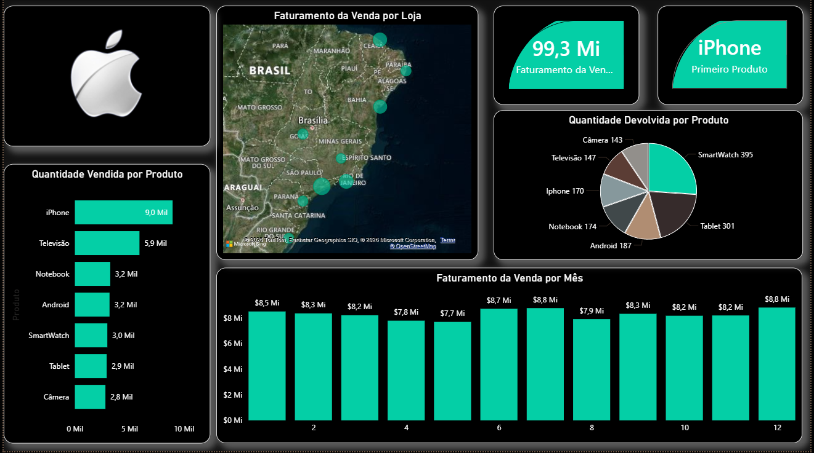

# 📊 Dashboard de Vendas - Power BI

## 🔎 Sobre o projeto
Dashboard desenvolvido para análise de vendas, com foco em faturamento, produtos e desempenho por região.

## 📌 Principais análises
- Faturamento por mês
- Produtos mais vendidos
- Quantidade devolvida
- Vendas por localização

## 🛠️ Ferramentas
- Power BI
- Excel

## 📷 Preview

## 🚀 Autor
Bruno Souza
